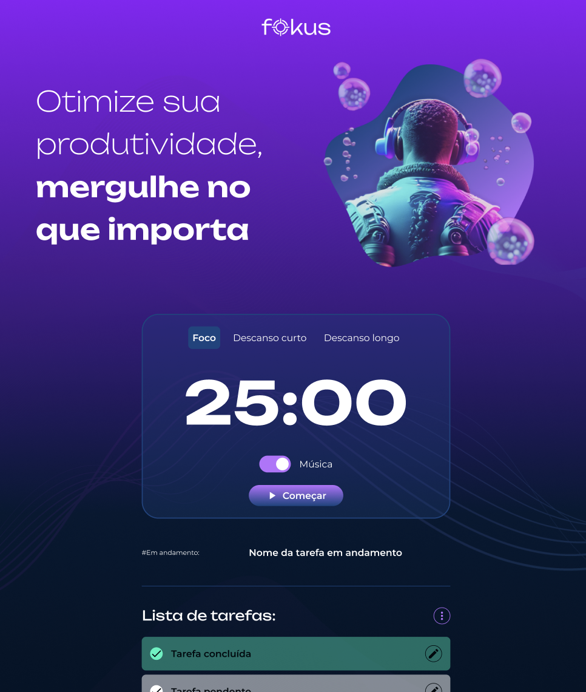

# ⏳ Fokus




## 📑 Índice

- [Descrição do Projeto](#-descrição-do-projeto)
- [Status do Projeto](#-status-do-projeto)
- [Funcionalidades e Demonstração da Aplicação](#-funcionalidades-e-demonstração-da-aplicação)
- [Acesso ao Projeto](#-acesso-ao-projeto)
- [Tecnologias Utilizadas](#-tecnologias-utilizadas)
- [Pessoas Contribuidoras](#-pessoas-contribuidoras)
- [Pessoas Desenvolvedoras do Projeto](#-pessoas-desenvolvedoras-do-projeto)
- [Licença](#-licença)

---

## 📖 Descrição do Projeto

O **Fokus** é uma aplicação web inspirada na técnica **Pomodoro**, desenvolvida para auxiliar usuários na organização de tarefas e gerenciamento do tempo durante sessões de estudo ou trabalho.

A aplicação permite alternar entre períodos de foco, descanso curto e descanso longo, acompanhados por um cronômetro regressivo, efeitos sonoros e música ambiente opcional. Além disso, conta com um sistema completo de gerenciamento de tarefas, permitindo criar, editar, selecionar e concluir atividades.

Um dos principais diferenciais do projeto é a integração entre o cronômetro e o sistema de tarefas por meio de **Custom Events**, permitindo que uma tarefa seja automaticamente marcada como concluída ao final de uma sessão de foco.

As tarefas são armazenadas utilizando **LocalStorage**, garantindo persistência dos dados mesmo após o fechamento do navegador.

---

## 🚧 Status do Projeto

✅ Projeto concluído

### Funcionalidades implementadas

- Cronômetro Pomodoro
- Modos de foco e descanso
- Reprodução de música ambiente
- Efeitos sonoros de interação
- Cadastro de tarefas
- Edição de tarefas
- Seleção de tarefa em andamento
- Conclusão automática de tarefas
- Remoção de tarefas concluídas
- Remoção de todas as tarefas
- Persistência de dados com LocalStorage

---

## ⚙️ Funcionalidades e Demonstração da Aplicação

### ⏱️ Cronômetro

- Iniciar e pausar sessões
- Alternar entre:
  - Foco
  - Descanso Curto
  - Descanso Longo
- Exibição dinâmica do tempo restante
- Alerta sonoro ao término da sessão
- Música ambiente opcional

### 📋 Gerenciamento de Tarefas

- Adicionar tarefas
- Editar tarefas existentes
- Selecionar tarefa ativa
- Marcar tarefas como concluídas
- Remover tarefas concluídas
- Remover todas as tarefas
- Salvar tarefas automaticamente no navegador

### 🔗 Integração entre Módulos

Ao finalizar uma sessão de foco, o cronômetro dispara um evento personalizado:

```javascript
const evento = new CustomEvent('focoFinalizado');
document.dispatchEvent(evento);
```

O módulo responsável pelas tarefas escuta esse evento:

```javascript
document.addEventListener('focoFinalizado', () => {
    // Marca a tarefa ativa como concluída
});
```

Isso permite que os módulos permaneçam desacoplados e facilita a manutenção da aplicação.

---

## 📁 Acesso ao Projeto

### Clonar o repositório

```bash
git clone https://github.com/hi-ury/fokus.git
```

### Acessar a pasta do projeto

```bash
cd fokus
```

### Executar

Abra o arquivo:

```text
index.html
```

em qualquer navegador moderno.

### Deploy

[Site Rodando](https://fokus-git-main-hiurys-projects-a72e670a.vercel.app/)

---

## 🛠️ Tecnologias Utilizadas

<div align="left">


</div>

### Linguagens e Tecnologias

- HTML5
- CSS3
- JavaScript (ES6+)
- LocalStorage
- DOM API
- CustomEvent
- Audio API

---

## 🤝 Pessoas Contribuidoras

Projeto desenvolvido durante os estudos da formação de JavaScript da Alura.

Contribuições são sempre bem-vindas através de Pull Requests ou sugestões de melhorias.

---

## 👨‍💻 Pessoas Desenvolvedoras do Projeto

| [<br><sub>James</sub>](https://github.com/) |
| :---: |

Responsável pela implementação das funcionalidades de:

- Cronômetro Pomodoro
- CRUD de tarefas
- Persistência com LocalStorage
- Manipulação do DOM
- Eventos personalizados
- Integração entre módulos

---

## 📄 Licença

Este projeto foi desenvolvido para fins educacionais durante os estudos de JavaScript e manipulação do DOM.

Sinta-se à vontade para utilizar, estudar e modificar o código para fins de aprendizado.

---

⭐ Se este projeto foi útil para você, considere deixar uma estrela no repositório.
